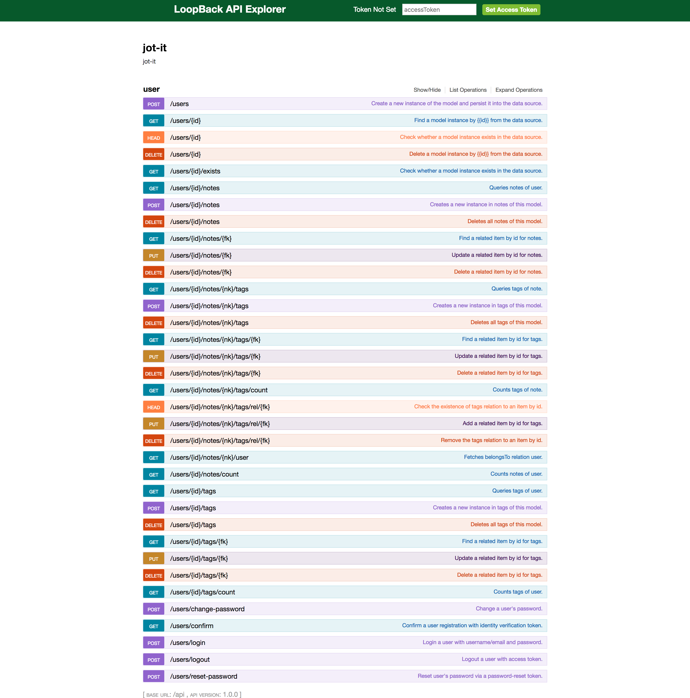

# jot-it

A notes API built with [LoopBack](http://loopback.io).

- cli tooling and scaffolding
- local user authentication
- data models and connecting to data sources (used PostgreSQL db)
- relations among tables
- RESTY APIs for resources

